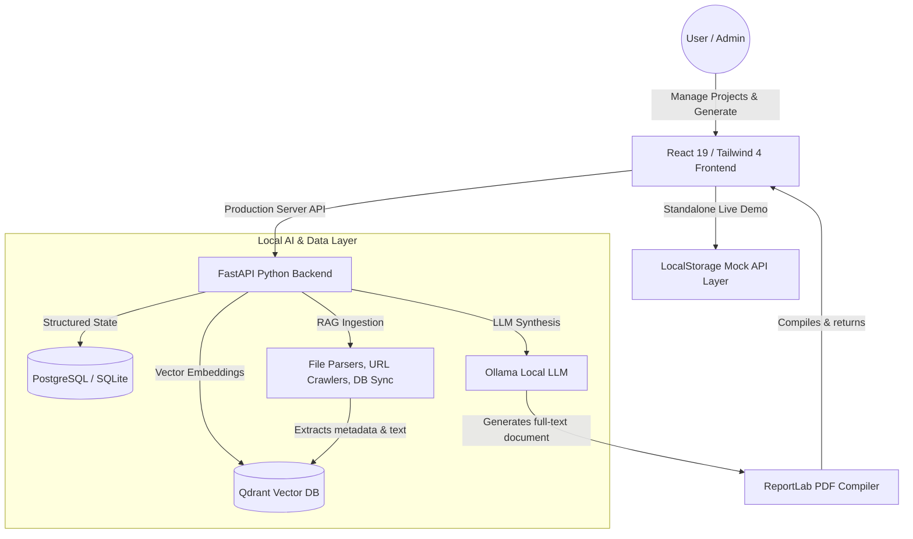

# Policy AI: Automated RAG-Powered Policy Generator 🚀

An AI-powered, full-stack enterprise application designed to compile, crawl, and synthesize diverse data sources into comprehensive, professionally formatted **25-30 page organizational policy documents**. 

Built with a privacy-first **Local RAG (Retrieval-Augmented Generation)** pipeline, the system connects directly to local SQL databases, crawls web URLs, parses multi-format files, and runs high-fidelity local LLMs. It also includes an **interactive standalone browser demo mode**—ideal for immediate portfolio review and static hosting platforms like Netlify.

---

## 🌟 Key Features

*   📂 **Multi-Format Data Ingestion**: Seamless parsing of PDFs, Word documents (`.docx`), CSVs, Excel spreadsheets, and JSON configuration files.
*   🔌 **Relational Database Integrations**: Connects to and crawls live PostgreSQL (or local SQLite) databases to vectorize structural schematics and schema metadata.
*   🌐 **URL Web Scraping**: Ingests, sanitizes, and indexes public documentation, privacy terms, or external compliance references via real-time web scraping.
*   🧠 **Local AI Pipeline (Zero API Costs)**: Orchestrated via **LangChain** and **Ollama** running local models (such as `Llama 3.1`, `Mistral`, or `DeepSeek-R1`). Complete security—no enterprise data ever leaves your machine.
*   🗄️ **Vector Database Indexing**: Leverages **Qdrant** for rapid vector embeddings and semantic search index matching.
*   📄 **Dynamic PDF Compilation**: Programmatically compiles generated Markdown policies into industry-ready, publication-grade PDFs with custom headers, footers, page numbering, and indexes using **ReportLab**.
*   💻 **Stand-alone Portfolio Mode**: A robust frontend mockup API that runs purely in the browser using `localStorage` persistence, allowing recruiters and managers to experience the entire CRUD, upload, crawl, and generation workflow in a live, zero-server Netlify demo.

---

## 🏗️ Architecture & Data Flow



---

## 🛠️ Technology Stack

### Frontend
*   **React 19** & **Vite** — Fast, light, and optimized UI development.
*   **Tailwind CSS 4** — Modern, component-optimized, CSS-first layout utility.
*   **React Router 7** — Declarative SPA client-side routing.
*   **Axios** & **React Hot Toast** — Rich state requests, custom response interceptors, and beautiful snackbar notifications.

### Backend
*   **FastAPI** — High-performance Python web framework for microservices.
*   **LangChain** — Leading framework for orchestrating LLM chains, document loaders, and semantic retrieval.
*   **SQLAlchemy** & **Alembic** — Modern Python ORM and database migrations.
*   **Qdrant** — Highly efficient, Production-grade vector search engine.
*   **Ollama** — Powering lightweight, privacy-focused open LLMs.
*   **ReportLab** — Pixel-perfect structural PDF compilation engine.

---

## ⚡ Live Demo (Netlify)

We have built a **fully interactive, standalone client-side Demo Mode** for this repository. When hosted on platforms like Netlify, the application runs a lightweight in-browser mockup server that mimics the exact full-stack experience using browser `localStorage`:

*   **Create, Edit, and Delete Projects** to manage independent workspaces.
*   **Simulate Document Uploads** with real-time uploading progress animations.
*   **Configure Mock Database Connections & Crawl URLs** to see visual syncing state.
*   **Simulate Policy Generation** with a live step-by-step progress indicator (Initializing -> Retrieving -> Synthesizing sections -> Compiling PDF).
*   **Preview and Download Policies** directly as formatted document files!

👉 **[Launch Live Netlify Demo](https://po-licygenerationai.netlify.app/)** *(Replace with your Netlify link once deployed!)*

---

## ⚙️ Local Full-Stack Setup

To run the complete system with the local Python backend, PostgreSQL, Qdrant, and Ollama, follow these steps:

### Prerequisites
*   Python 3.10+
*   Node.js 18+
*   Ollama installed locally ([Download here](https://ollama.com/))
*   Qdrant and PostgreSQL running (via Docker or local install)

### 1. Vector & LLM Server Setup
Launch Ollama and download your preferred model:
```bash
ollama run llama3.1:8b-instruct-q4_K_M
```

Launch Qdrant (in-memory mode requires no setup, but Docker is recommended):
```bash
docker run -p 6333:6333 qdrant/qdrant
```

### 2. Backend Installation
1. Navigate to the backend folder:
   ```bash
   cd backend
   ```
2. Create and activate a Python virtual environment:
   ```bash
   python -m venv venv
   # On Windows:
   venv\Scripts\activate
   # On macOS/Linux:
   source venv/bin/activate
   ```
3. Install dependencies:
   ```bash
   pip install -r requirements.txt
   ```
4. Copy the environment template and customize:
   ```bash
   cp .env.example .env
   ```
5. Launch the FastAPI server:
   ```bash
   uvicorn app.main:app --reload
   ```
   The backend will be available at `http://localhost:8000`. API documentation is accessible at `http://localhost:8000/docs`.

### 3. Frontend Installation
1. Navigate to the frontend folder:
   ```bash
   cd ../frontend
   ```
2. Install npm packages:
   ```bash
   npm install
   ```
3. Copy environment configuration:
   ```bash
   cp .env.example .env
   ```
4. Run in development mode:
   ```bash
   npm run dev
   ```
   Open `http://localhost:5173` in your browser.

---

## 📄 License
This project is open-source and available under the [MIT License](LICENSE).
